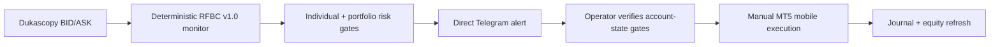
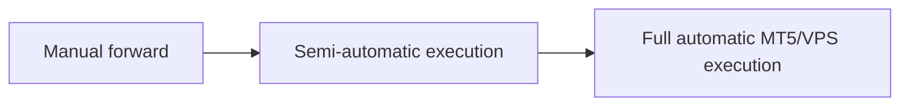

# RFBC v1.0 Live Operations Manual

> **Status:** READY FOR SMALL MANUAL FORWARD TRADING  
> **Live symbols:** `USDJPYc`, `AUDJPYc`  
> **Execution mode:** Telegram alert -> manual MT5 mobile  
> **Prepared:** 9 September 2026

---

## Operator card

| Item | Rule |
|---|---|
| Strategy | Frozen RFBC v1.0 |
| Symbols | USDJPYc, AUDJPYc only |
| Volume | 0.01 maximum |
| Individual risk | <= 1.00% |
| Aggregate initial open risk | <= 1.00% |
| Daily stop | -1.00% realized RFBC loss |
| Weekly stop | -2.00% realized RFBC loss |
| DD warning | -3.00% from closed-balance HWM |
| Hard kill | -5.00% from closed-balance HWM |
| Friday flat | 16:00 UTC |
| Discretion | None |

> **If an alert says SKIP, STALE or ERROR, do not trade.**

---

## Live flow



---

## Before every trade

- Confirm the Telegram alert came from **G's Fx 101**.
- Confirm symbol is exactly `USDJPYc` or `AUDJPYc`.
- Confirm the action is `TRADE`.
- Confirm volume is 0.01.
- Confirm account balance/equity has not materially changed from the configured sizing input.
- Confirm daily loss is less than 1%.
- Confirm weekly loss is less than 2%.
- Confirm closed-balance drawdown is below the 3% warning / 5% hard-kill levels.
- Confirm there is no manual/non-RFBC position that would make the stated portfolio risk misleading.
- Place only the supplied direction, SL and TP.
- Never chase a missed entry.

---

## Alert actions

| Alert | Meaning | Operator response |
|---|---|---|
| `TRADE` | Valid RFBC signal and automated risk gates passed | Verify account-state gates, then place exact ticket |
| `SKIP_RISK` | Minimum executable volume exceeds individual cap | Do not trade |
| `SKIP_CHASE` | Entry moved beyond frozen 0.20 ATR chase tolerance | Do not trade |
| `SKIP_PORTFOLIO_RISK` | New trade would breach aggregate 1% cap | Do not add position |
| `MOVE_BE` | Completed H4 close reached frozen BE trigger | Move SL only to supplied BE level |
| `FRIDAY_CLOSE` | Frozen Friday flat checkpoint | Close stated RFBC position |
| `STALE` | Monitor data is not fresh enough | Do not trade |
| `ERROR` | Monitor failed | Do not trade |
| `NONE` | No action | Do nothing |

---

## Exact RFBC management

### Entry

Entry is only after a frozen eligible H4 signal and only if the no-chase and risk gates pass.

### Stop

Initial SL = **1.50 x signal ATR**.

### Target

TP = **2.50R**.

### Breakeven

Move SL only after a **completed H4 close** reaches at least **+1.50R**. Do not move it early because price touched +1.50R intrabar.

### Friday

All RFBC positions must be flat at **16:00 UTC Friday**.

---

## Simultaneous USDJPYc / AUDJPYc signals

Both pairs contain JPY, so simultaneous signals can create concentrated event risk.

The monitor enforces:

1. Existing RFBC initial risk counts first.
2. Total initial open risk may not exceed 1%.
3. If both new trades cannot fit, the lower-risk candidate is selected.
4. If risks are effectively equal, USDJPYc is the deterministic tie-break.
5. The blocked signal is not taken later as a chase/re-entry.

---

## Current account reference

Snapshot on 9 September 2026:

| Field | Value |
|---|---:|
| Balance | 1,001 USC |
| Equity | 1,001 USC |
| USD equivalent | $10.01 |

Reference thresholds at this equity:

| Threshold | Approx. USD | Approx. USC |
|---|---:|---:|
| 1% | $0.1001 | 10.01 USC |
| 2% | $0.2002 | 20.02 USC |
| 3% | $0.3003 | 30.03 USC |
| 5% | $0.5005 | 50.05 USC |

Percentages remain authoritative as equity changes.

---

## After every closed trade

1. Record symbol, side, entry, SL, TP, exit, result in R and account currency.
2. Record whether exit was SL, TP, BE, Friday close or other allowed frozen event.
3. Update daily and weekly realized RFBC loss totals.
4. Update closed-balance high-water mark if a new high is made.
5. Update Render `RFBC_EQUITY_USD` before the next trade if equity changed materially.
6. Save any execution anomaly: spread spike, slippage, late alert, missed alert, manual mistake.

Journal source: `execution/RFBC_V10_LIVE_JOURNAL_AND_REVIEW.md`.

---

## Monitoring reliability

Current zero-cost architecture:

```text
Scheduled wake/check -> Render RFBC monitor -> Telegram -> MT5 mobile
```

The monitor startup self-test validates the pair map, sizing conversions, portfolio gate and all operator-facing alert formats. Direct Render-to-Telegram delivery has been received successfully on the phone.

A free Render cron service is not available, so the H4 trigger is currently scheduled externally. Full unattended automation must eventually use an MT5 EA, VPS or dedicated scheduler rather than ChatGPT in the timing path.

---

## Hard prohibitions

- No martingale.
- No grid recovery.
- No averaging into losers.
- No stop widening.
- No pyramiding.
- No discretionary early exits.
- No extra filters added live.
- No pair outside USDJPYc/AUDJPYc under RFBC v1.0.
- No increasing volume above 0.01 on the current tiny account.
- No trade when account-state data is stale.

---

## Forward-phase review

RFBC v1.0 is now in the **small manual forward-trading phase**.

Formal review occurs after approximately **30 live/forward trades or six months**, whichever provides the more meaningful evidence window. Review execution quality, live expectancy, spread/slippage, alert reliability, operational errors and whether historical behavior remains plausible.

Do not retune RFBC during this evidence collection period merely because of a short losing streak.

---

## Escalation path



Move forward only after operational reliability and forward evidence justify the next stage.
