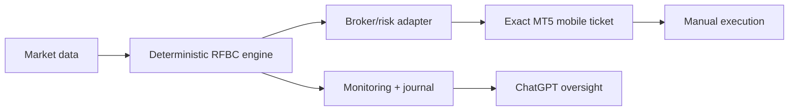

# RFBC v1.0
## Master System Manual, Validation Record & Live-Readiness Guide

> **Version:** RFBC v1.0  
> **Prepared:** 9 September 2026  
> **Research-qualified pairs:** **USDJPY, AUDJPY**  
> **Live status:** **PENDING final operational qualification**  
> **Source of truth:** this repository + committed independent validation outputs

---

## Executive decision

RFBC v1.0 survived independent external testing on exactly **two** instruments: **USDJPY** and **AUDJPY**.

> **DECISION:** The frozen RFBC v1.0 research pair set is **USDJPY + AUDJPY**. No arbitrary pair cap is applied; the other 13 tested pairs were rejected by the unchanged promotion gate.

RFBC is now frozen as a research-qualified strategy. It should not be retuned merely to create more signals or force additional pairs.

---

## Frozen strategy rules

| Component | RFBC v1.0 rule |
|---|---|
| D1 regime | EMA50 vs EMA200 + EMA50 slope over 5 completed D1 candles |
| H4 trigger | Strict 20-bar breakout against preceding completed H4 bars |
| Signal candle filter | True range <= 2.0 x ATR(14) |
| Eligible closes | Mon-Thu 08:00 / 12:00 / 16:00 UTC; Fri 08:00 / 12:00 UTC |
| Entry | Next H4 open; cancel if adverse displacement > 0.20 x signal ATR |
| Initial SL | 1.50 x signal ATR |
| TP | 2.50R |
| Breakeven | Completed H4 close >= +1.50R, then cost-adjusted BE |
| Friday rule | Flat at 16:00 UTC |
| Discretionary overrides | Not permitted |

### Strategy integrity

**Do not silently add:** H1 confirmation, D1 invalidation exits, arbitrary time stops, ATR-quantile filters, discretionary early exits, averaging down, pyramiding or pair-specific tuning.

Any strategic change creates a **new version** and must be independently revalidated.

---

## Independent validation evidence

| Pair | Trades | Expectancy | PF | Max DD | Unseen expectancy | Unseen PF | Decision |
|---|---:|---:|---:|---:|---:|---:|---|
| USDJPY | 248 | +0.1833R | 1.403 | 5.22% | +0.2021R | 1.468 | **SURVIVED** |
| AUDJPY | 247 | +0.1998R | 1.426 | 3.70% | +0.1824R | 1.409 | **SURVIVED** |

### Portfolio evidence

| Metric | Result |
|---|---:|
| Return correlation | 0.0227 |
| Drawdown correlation | -0.0850 |
| Overlapping trade pairs | 89 |
| Portfolio MC DD P50 | 3.76% |
| Portfolio MC DD P95 | 6.43% |
| P(portfolio DD >10%) | 0.22% |

> **RISK NOTE:** both survivors contain JPY. The historical return/drawdown relationship is low-correlation, but common JPY event exposure remains a live portfolio risk that must be controlled operationally.

Raw evidence: `results_external_discovery/`.

---

## Full 15-pair discovery decision

| Pair | Decision | Pair | Decision |
|---|---|---|---|
| EURUSD | REJECTED | EURJPY | REJECTED |
| GBPUSD | REJECTED | GBPJPY | REJECTED |
| AUDUSD | REJECTED | AUDJPY | **SURVIVED** |
| NZDUSD | REJECTED | CADJPY | REJECTED |
| USDCAD | REJECTED | CHFJPY | REJECTED |
| USDCHF | REJECTED | EURGBP | REJECTED |
| USDJPY | **SURVIVED** | EURAUD | REJECTED |
| GBPAUD | REJECTED |  |  |

**Promotion gate:** full expectancy >= +0.15R; full PF >= 1.30; unseen expectancy > 0.

The gate was not moved after seeing results.

---

## Tiny-account execution overlay

The current Exness Standard Cent account requires a separate execution overlay because minimum lot granularity can force risk above the normal 0.50% target.

| Control | Current tiny-account rule |
|---|---|
| Preferred risk | Lowest executable risk consistent with broker minimum volume |
| Hard risk / trade | **1.00% maximum** |
| Total initial open risk | **1.00% maximum** |
| Daily stop | **1.00%** |
| Weekly stop | **2.00%** |
| DD warning | **3.00%** below closed-balance high-water mark |
| Hard DD kill | **5.00%** |
| Current minimum volume | 0.01 on validated cent symbols |
| Volume escalation | Forbidden merely to target a desired risk percentage |

> **IMPORTANT:** a valid RFBC signal may still be skipped if the broker minimum volume makes actual account risk exceed the hard cap. This is an execution constraint, not a strategy change.

---

## Manual ticket format

```text
STRATEGY: RFBC v1.0
PAIR: [USDJPYc / AUDJPYc]
SIDE: [BUY / SELL]

VALID UNTIL: [UTC timestamp]
ENTRY: MARKET
MAX ACCEPTABLE ENTRY: [price]

SL: [price]
TP: [price]

ACCOUNT EQUITY: [fresh amount]
RISK: [percentage]
CASH RISK: [amount]
VOLUME: [cent lots]

DAILY LOSS USED: [x%]
WEEKLY LOSS USED: [x%]
OPEN RISK AFTER FILL: [x%]

MANAGEMENT:
Move SL only after a completed H4 close >= +1.50R.
Friday flat at 16:00 UTC.
Otherwise hold.

CANCEL IF:
price exceeds maximum entry,
risk gate fails,
portfolio gate fails,
data is stale,
ticket expires.
```

---

## Operational architecture



**ChatGPT is not part of the critical execution path.**

Automation roadmap:


Full automatic execution comes only after forward evidence and operational reliability justify it.

---

## Live-enable checklist

- [x] USDJPY independently research-qualified
- [x] AUDJPY independently research-qualified
- [x] 15-pair discovery completed without arbitrary pair cap
- [x] Portfolio correlation / overlap / Monte Carlo reviewed
- [x] USDJPYc broker properties substantially validated
- [ ] AUDJPYc broker properties validated
- [ ] Fresh account equity loaded before live sizing
- [ ] AUDJPYc 0.01-volume risk tested under realistic ATR stop distances
- [ ] Simultaneous USDJPYc/AUDJPYc overlay implemented and end-to-end tested
- [ ] Alert path proven reliable for signals and management events
- [ ] Breakeven management tested end to end
- [ ] Friday-close management tested end to end

> **LIVE STATUS:** RFBC v1.0 is **research-qualified but not yet fully live-ready**.

---

## After operationalisation

Once the live-enable checklist is complete, RFBC should enter small forward/live execution **without strategy changes**.

A separate Strategy 2 research track may then begin. It should preferably express a meaningfully different edge so the eventual portfolio is diversified by both **strategy** and **instrument**, rather than simply multiplying the same breakout exposure.

### Expansion rule

- Do not force more RFBC pairs.
- Do not cap valid future strategy portfolios at five or any other arbitrary number.
- Keep every independently qualified component only if portfolio testing supports it.
- Preserve RFBC v1.0 as an immutable evidence chain.

---

## Documentation rule

All formal RFBC documentation follows `docs/DOCUMENTATION_STANDARD.md`: structured title/status blocks, concise sections, tables, callouts, diagrams/checklists where useful, and polished PDF/DOCX equivalents for master documents and formal validation records.
